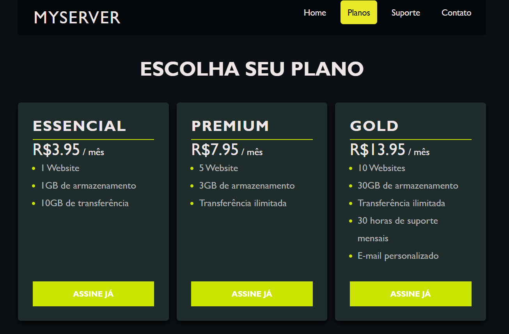

## Escolha seu plano 👨🏻‍💻

Este projeto foi desenvolvido durante o curso **Web Frontend Fundamentos (HTML, CSS, JS)**, com o objetivo de criar uma página simples focada na exibição de planos. A proposta principal era praticar o desenvolvimento de uma estrutura básica de site, com ênfase na parte de apresentação de planos, algo comumente encontrado em muitos sites comerciais.

O projeto não possui funcionalidades complexas, mas serve como uma ótima base para entender e aplicar conceitos de HTML e CSS em um contexto prático e realista. Estou o postando no GitHub apenas para fins de documentação e para manter um registro do aprendizado.

## Resultado:

